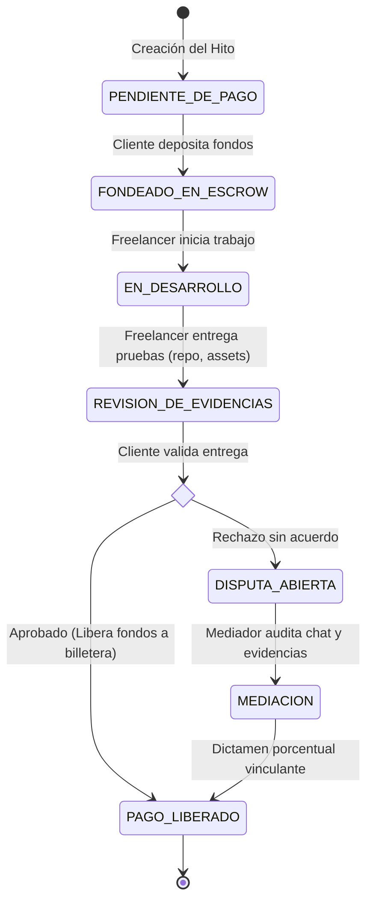
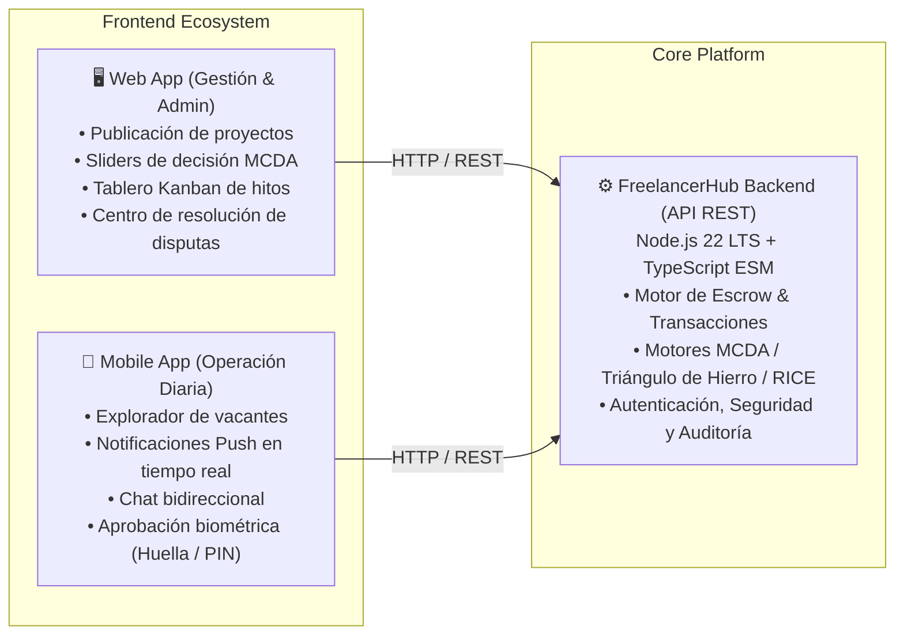

<div align="center">

# 💼 FreelancerHub — Backend API

**Plataforma de intermediación y gobernanza para proyectos freelance con garantía de pago (Escrow) y toma de decisiones algorítmicas.**

[](https://nodejs.org/)
[-3178C6?style=flat-square&logo=typescript&logoColor=white)](https://www.typescriptlang.org/)
[](https://pnpm.io/)
[](#licencia)
[](#arquitectura)

<p align="center">
  <a href="#-la-problemática">Problemática</a> •
  <a href="#-solución-y-flujo-escrow">Flujo Escrow</a> •
  <a href="#-módulos-de-decisión-mdp">Módulos de Decisión</a> •
  <a href="#-ecosistema-de-aplicaciones">Ecosistema</a> •
  <a href="#-stack-tecnológico">Stack</a> •
  <a href="#-instalación-y-uso">Instalación</a> •
  <a href="#-variables-de-entorno">Variables de Entorno</a>
</p>

</div>

---

## 🎯 La Problemática

En el ecosistema tradicional de trabajo independiente y desarrollo por encargo, la fricción y desconfianza generan pérdidas económicas y retrasos recurrentes:

| Desafío Tradicional | Impacto en Freelancers | Impacto en Clientes |
| :--- | :--- | :--- |
| **Incertidumbre de Pago / Anticipos** | Temor a entregar el producto final y no recibir la liquidación o que el cliente desaparezca. | Temor a soltar anticipos y recibir entregas deficientes, tardías o abandono del proyecto. |
| **Scope Creep Descontrolado** | Presión para realizar cambios continuos ("*nomás cámbiale esto*") sin presupuesto ni tiempo extra. | Falta de claridad en los límites del alcance y entregables pactados. |
| **Selección Subjetiva** | Dependencia de tarifas a la baja en lugar de visibilidad de valor real y especialización. | Contratación por intuición o corazonadas en vez de evaluación objetiva basada en datos. |

---

## 🛡️ Solución y Flujo Escrow (Custodia Blindada)

**FreelancerHub** opera como un intermediario técnico y financiero neutral con reglas automatizadas por hitos (*milestones*):



1. **Custodia en Escrow (`FONDEADO_EN_ESCROW`):** El cliente fondea el valor del hito antes de iniciar. Los fondos quedan asegurados en la plataforma, garantizando liquidez al freelancer sin riesgo de impago.
2. **Entrega de Evidencias Verificables:** El freelancer registra enlaces a repositorios de código, entregables de diseño, documentación y artefactos.
3. **Liberación Instantánea:** Una vez que el cliente aprueba la entrega, el sistema liquida y transfiere los fondos de forma directa a la billetera digital del freelancer.
4. **Mecanismo de Disputas & Mediación:** Ante desacuerdos no conciliados, los fondos permanecen congelados y un mediador/administrador evalúa el historial de trazabilidad (mensajes, requerimientos originales y entregas) emitiendo una resolución vinculante.

---

## 🧠 Módulos de Decisión (MDP — Mathematical Decision Platform)

A diferencia de directorios convencionales, FreelancerHub integra modelos matemáticos deterministas para eliminar la subjetividad:

```
                  ┌────────────────────────────────────────┐
                  │      Módulos de Decisión (MDP)         │
                  └────────────────────────────────────────┘
                       │              │              │
         ┌─────────────┴──────┐ ┌─────┴──────┐ ┌─────┴────────────┐
         │   Ponderador MCDA  │ │  Triángulo │ │  Priorizador     │
         │   (Multi-Criteria) │ │  de Hierro │ │  RICE            │
         └────────────────────┘ └────────────┘ └──────────────────┘
```

### 1. 📊 Ponderador MCDA (*Multi-Criteria Decision Analysis*)
Permite al cliente definir ponderaciones mediante controles interactivos (ej. $40\%$ Presupuesto, $30\%$ Tiempo de Entrega, $30\%$ Reputación/Score). El algoritmo calcula el score global de cada postulante y entrega un ranking matemático ordenado.

$$\text{Score}_i = \sum_{j=1}^{m} w_j \cdot v_{ij}$$

### 2. 📐 Regulador del Triángulo de Hierro (*Scope, Cost, Time*)
Control estricto anti-*scope creep*. Cualquier solicitud de cambio funcional o pantalla adicional recalcula el balance del proyecto. El sistema bloquea modificaciones en los requerimientos a menos que el cliente apruebe el incremento proporcional en presupuesto o la extensión en la fecha límite de entrega.

### 3. 🎯 Priorizador RICE (*Reach, Impact, Confidence, Effort*)
Estructura y prioriza la lista de entregables e hitos del proyecto maximizando el retorno de inversión y valor comercial en las etapas tempranas:

$$\text{RICE Score} = \frac{\text{Alcance} \times \text{Impacto} \times \text{Confianza}}{\text{Esfuerzo}}$$

---

## 📱 Ecosistema de Aplicaciones



---

## 💻 Stack Tecnológico (Backend)

- **Runtime:** [Node.js 22 LTS](https://nodejs.org/)
- **Lenguaje:** [TypeScript 5.x](https://www.typescriptlang.org/) configurado en modo **ESM nativo** (`NodeNext`)
- **Gestor de Paquetes:** [pnpm](https://pnpm.io/)
- **Framework Web:** [Express 4](https://expressjs.com/)
- **Seguridad & Utilidades:** [Helmet](https://helmetjs.github.io/), [CORS](https://github.com/expressjs/cors), [Morgan](https://github.com/expressjs/morgan)
- **Validación de Datos & Entorno:** [Zod](https://zod.dev/) + [Dotenv](https://github.com/motdotla/dotenv)
- **Desarrollo & Compilación:** [tsx](https://github.com/privatenumber/tsx), [tsc](https://www.typescriptlang.org/), [rimraf](https://github.com/isaacs/rimraf)

---

## 📂 Estructura del Código

```text
freelancer_hub_backend/
├── src/
│   ├── config/          # Variables de entorno validadas con Zod
│   ├── middlewares/     # Middleware de seguridad, CORS, 404 y error handler global
│   ├── routes/          # Declaración y agrupamiento de rutas REST
│   │   ├── health.route.ts
│   │   └── index.ts
│   ├── app.ts           # Configuración de Express y middlewares globales
│   └── index.ts         # Punto de entrada HTTP y cierre controlado (Graceful Shutdown)
├── dist/                # Salida de compilación en JavaScript ESM
├── .env.example         # Plantilla de variables de entorno
├── package.json         # Dependencias y scripts de ejecución
├── pnpm-lock.yaml       # Lockfile determinista de pnpm
└── tsconfig.json        # Configuración del compilador TypeScript ESM
```

---

## 🚀 Instalación y Uso

### Prerrequisitos
- **Node.js**: `>= 22.0.0`
- **pnpm**: `>= 9.0.0`

### 1. Clonar el repositorio
```bash
git clone <URL_DEL_REPOSITORIO>
cd freelancer_hub_backend
```

### 2. Instalar dependencias
```bash
pnpm install
```

### 3. Configurar variables de entorno
```bash
cp .env.example .env
```

### 4. Ejecución en desarrollo
Inicia el servidor en modo observación con recarga automática (*hot-reload*):
```bash
pnpm dev
```

### 5. Compilación y producción
```bash
# Verificar tipos TypeScript
pnpm typecheck

# Compilar proyecto a JavaScript ESM en ./dist
pnpm build

# Ejecutar el servidor compilado
pnpm start
```

---

## ⚙️ Variables de Entorno

| Variable | Tipo | Descripción | Valor por Defecto |
| :--- | :--- | :--- | :--- |
| `PORT` | `number` | Puerto donde escuchará el servidor HTTP | `4000` |
| `NODE_ENV` | `string` | Entorno de ejecución (`development`, `production`, `test`) | `development` |
| `CLIENT_ORIGIN` | `string` | URL permitida para solicitudes vía CORS | `http://localhost:3000` |

---

## 📡 Endpoints Base

| Método | Endpoint | Descripción | Respuesta |
| :--- | :--- | :--- | :--- |
| `GET` | `/` | Estado general del servicio API | `200 OK` |
| `GET` | `/api/health` | Estado de salud, uptime y timestamp del servidor | `200 OK` |

---

## 📄 Licencia

Este proyecto está bajo la Licencia **ISC**.
